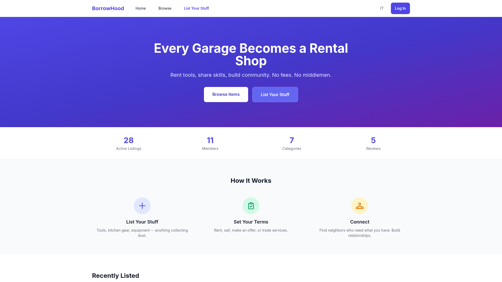
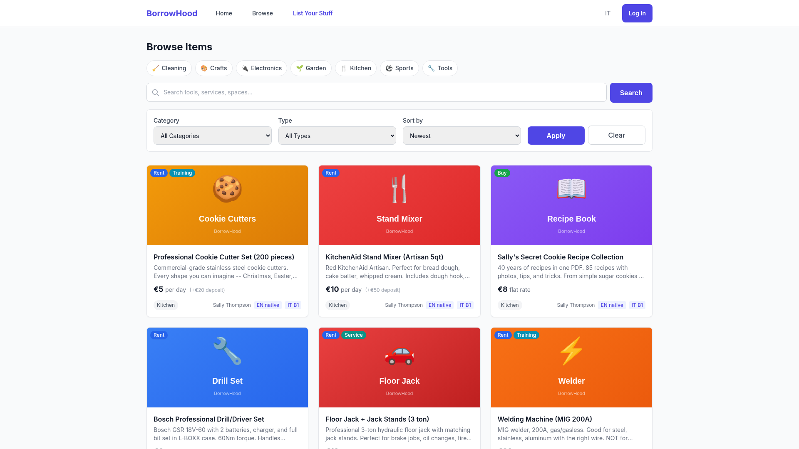
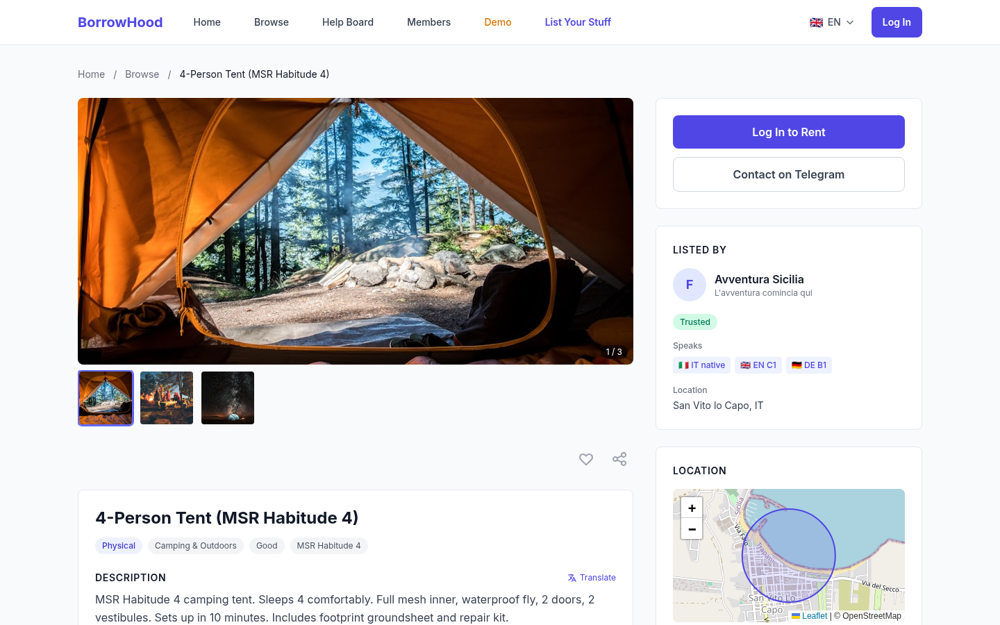
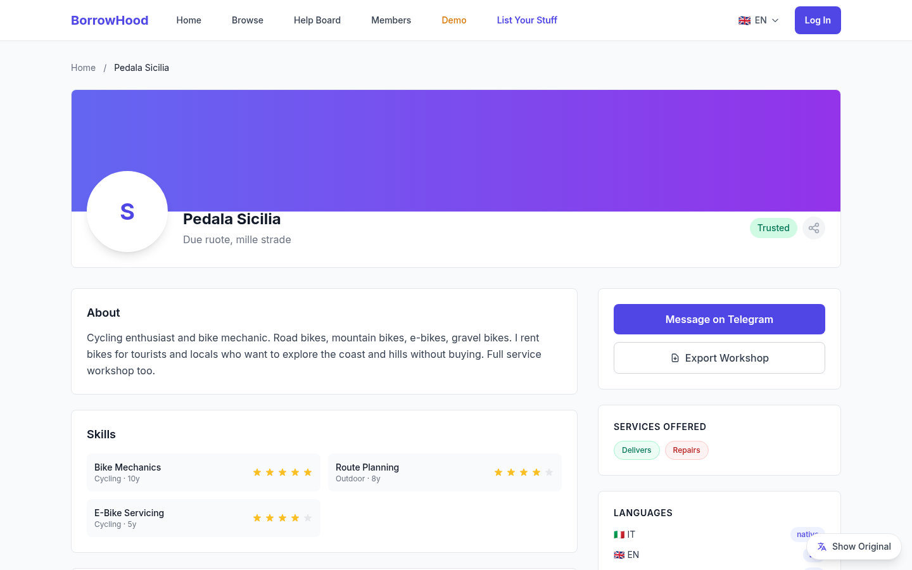
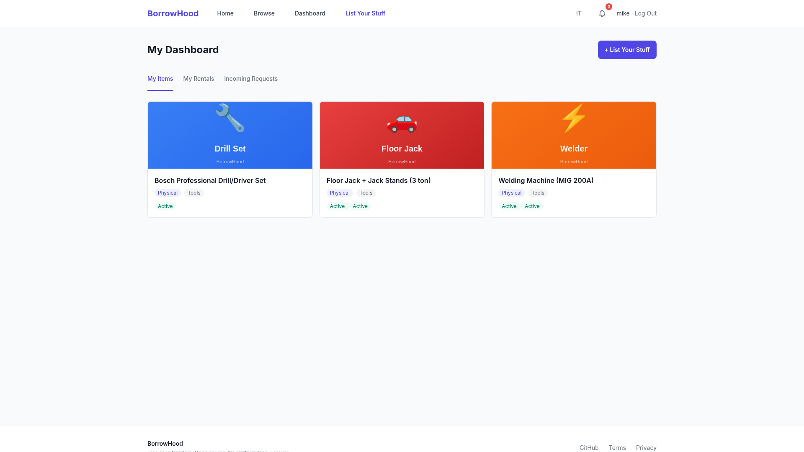

# BorrowHood

**"Rent it. Lend it. Share it. Teach it."**

*Free as in freedom. Open source. No platform fees. Forever.*

**Live demo:** [https://46.62.138.218:8443](https://46.62.138.218:8443) (Hetzner UAT -- test user: `angel` / `helix_pass`)

---

## Screenshots

| Home | Browse | Item Detail |
|------|--------|-------------|
|  |  |  |

| Workshop Profile | Dashboard |
|------------------|-----------|
|  |  |

---

## What Is BorrowHood?

A community rental, services, and skills platform. People list their underused tools, kitchen gear, equipment, and skills -- and neighbors borrow, rent, or trade. No middlemen. No fees. No algorithm deciding who sees what.

Every user is a workshop. Every garage becomes a rental shop. Every kitchen becomes a bakery.

## The Origin Story

My father Albert was a hand-shovel landscaper in Switzerland from 1960 to 2020. His garage had 500 tools. When he passed, they sat there collecting dust. His neighbors still needed shovels, rakes, and chainsaws -- they just didn't know where to look.

Craigslist is a wasteland. Facebook Marketplace is a data farm. None of them care about your community.

BorrowHood fixes that. Built from a camper van in Trapani, Sicily.

## DEV Weekend Challenge

This project was built for the [DEV Weekend Challenge](https://dev.to/challenges/claude) -- Anthropic Claude Code edition.

**Built with:** Claude Code (Claude Opus 4.6) as co-pilot.

---

## Features

### For Users
- **List anything** -- tools, kitchen gear, digital goods, services, spaces, made-to-order items
- **Seven listing types** -- Rent, Sell, Commission, Offer, Service, Training, Auction
- **Bilingual** -- English + Italian (474 translatable strings, 3-tier language detection)
- **Workshop profiles** -- Every user is a shop with skills, languages (CEFR levels), and social links
- **Reputation system** -- Reviews weighted by reviewer badge tier (Newcomer 1x to Legend 10x)
- **Rental state machine** -- Request > Approve > Pickup > Return > Complete (with dispute handling)
- **Auction system** -- Timed bidding with auto-outbid notifications, reserve prices, bid increments
- **Dispute resolution** -- 3-step flow: file, respond, resolve (8 reasons, 7 resolution types)
- **Security deposits** -- Hold at pickup, release on return, forfeit on damage
- **Lockbox codes** -- One-time 8-character codes for contactless pickup and return
- **PayPal payments** -- Create order, buyer approves, capture, refund
- **Notification bell** -- In-app notifications with 15 event types + optional Telegram forwarding
- **Community helpboard** -- Post requests, get replies, track status
- **AI-assisted listings** -- Generate descriptions, images, and skill bios via Pollinations
- **Onboarding wizard** -- 3-step profile setup for new users

### For Developers
- **104 REST API endpoints** with OpenAPI docs (`/docs`)
- **250 automated tests** across 23 test files
- **31 SQLAlchemy models** with UUID PKs, soft deletes, audit timestamps
- **36 typed enums** -- no magic strings anywhere
- **Keycloak OIDC** -- enterprise SSO with 6 realm roles and RBAC
- **Idempotency keys** on rental requests (no double-submit)
- **Optimistic locking** on listings (version field)
- **PayPal REST API v2** integration (sandbox + live)
- **Telegram bot** for notification forwarding
- **QA dashboard** -- bug tracking, test phases, activity trails
- **Backlog board** -- project management with status tracking

## Tech Stack

| Layer | Technology |
|-------|-----------|
| Backend | FastAPI + SQLAlchemy 2.0 async + asyncpg |
| Auth | Keycloak OIDC (RS256 JWT, 6 roles) |
| Database | PostgreSQL 17 |
| Cache | Redis 7 |
| Queue | RabbitMQ 3.13 |
| Object Storage | MinIO |
| Frontend | Jinja2 SSR + Tailwind CSS (CDN) + Alpine.js (CDN) |
| Fonts | Google Fonts (Inter) via CDN |
| Payments | PayPal REST API v2 (sandbox + live) |
| AI | Pollinations API (image + text generation) |
| Bot | Telegram Bot API |
| Tests | pytest + pytest-asyncio (250 tests) |
| Container | Docker |
| Reverse Proxy | Caddy 2 (automatic TLS) |
| Hosting | Hetzner CX32 (4 vCPU, 8 GB RAM, EUR 7.59/mo) |

No bundled subsets. Full CDN libraries only.

---

## Architecture

```
Browser
  |
  v
Caddy (TLS termination)
  |
  v
FastAPI (uvicorn)
  |
  +-- Page Routes (Jinja2 SSR) -----> 18 templates (base + pages)
  |     |
  |     +-- i18n engine (EN/IT) ----> 474 translatable strings
  |
  +-- API Routes (/api/v1/) --------> 104 endpoints, JSON
  |     |
  |     +-- Items CRUD + search
  |     +-- Listings CRUD + filters
  |     +-- Rentals (state machine)
  |     +-- Reviews (weighted scoring)
  |     +-- Bids (auction system)
  |     +-- Deposits (hold/release/forfeit)
  |     +-- Disputes (3-step resolution)
  |     +-- Payments (PayPal checkout)
  |     +-- Lockbox (pickup/return codes)
  |     +-- Notifications (bell + Telegram)
  |     +-- Badges (reputation tiers)
  |     +-- Helpboard (community posts)
  |     +-- AI (image + listing generation)
  |     +-- QA (bug tracking, test phases)
  |     +-- Backlog (project board)
  |     +-- Onboarding, Reports, Health
  |
  +-- Auth Routes ------------------> Keycloak OIDC
  |
  +-- SQLAlchemy async -------------> PostgreSQL
  |     |
  |     +-- 31 models (UUID PKs, soft deletes)
  |     +-- 36 typed enums
  |     +-- Seed data (12 workshops, 119 items)
  |
  +-- Redis (caching) + RabbitMQ (task queue) + MinIO (file storage)
```

## Data Model

```
BHUser (every user IS a workshop)
  |-- BHUserLanguage (CEFR levels: A1-C2, Native)
  |-- BHUserSkill (self-declared, community-verified)
  |-- BHUserPoints (reputation tracking)
  |-- BHUserSocialLink (YouTube, Instagram, etc.)
  |-- BHUserFavorite (saved items)
  |-- BHNotification (in-app + Telegram, 15 event types)
  |-- BHTelegramLink (account linking)
  |
  +-- BHItem (tools, equipment, services, spaces -- 21 categories)
  |     |-- BHItemMedia (photos, video embeds)
  |     +-- BHContentTranslation (multi-language content)
  |
  +-- BHListing (rent, sell, commission, offer, service, training, auction)
  |     |-- BHBid (auction bids with auto-outbid)
  |     +-- BHRental (state machine: pending -> completed)
  |           |-- BHReview (weighted by reviewer badge tier)
  |           |-- BHDeposit (hold -> release/forfeit)
  |           |-- BHPayment (PayPal checkout flow)
  |           |-- BHLockBoxAccess (pickup/return codes)
  |           +-- BHDispute (3-step: file -> respond -> resolve)
  |
  +-- BHHelpPost + BHHelpReply (community helpboard)
  +-- BHReport (content moderation)
  +-- BHWorkshopMember (team management)
  +-- BHBadge (achievement system)
  +-- BHAuditLog (system audit trail)

QA Module:
  BHTestResult, BHBugReport, BHBugActivity, BHBugCommit
  BHBacklogItem, BHBacklogActivity
```

---

## API Endpoints

### Public (no auth required)
| Method | Path | Description |
|--------|------|-------------|
| GET | `/api/v1/health` | Health check with DB status |
| GET | `/api/v1/items` | List items (search, filter, sort, paginate) |
| GET | `/api/v1/items/{id}` | Item detail |
| GET | `/api/v1/listings` | List listings (filter by item, status, type) |
| GET | `/api/v1/listings/{id}` | Listing detail |
| GET | `/api/v1/reviews` | List reviews (filter by user) |
| GET | `/api/v1/reviews/summary/{user_id}` | Review summary (avg, weighted avg, count) |
| GET | `/api/v1/bids/summary` | Auction summary (current price, winner) |
| GET | `/api/v1/users` | List community members |
| GET | `/api/v1/users/{id}` | User profile |
| GET | `/api/v1/badges/catalog` | Available badges |

### Authenticated (Keycloak JWT required)
| Method | Path | Description |
|--------|------|-------------|
| POST | `/api/v1/items` | Create item |
| PATCH | `/api/v1/items/{id}` | Update item (owner only) |
| DELETE | `/api/v1/items/{id}` | Soft-delete item (owner only) |
| POST | `/api/v1/items/{id}/media` | Add media to item |
| POST | `/api/v1/items/{id}/upload` | Upload image |
| POST | `/api/v1/listings` | Create listing |
| PATCH | `/api/v1/listings/{id}` | Update listing (owner only) |
| DELETE | `/api/v1/listings/{id}` | Soft-delete listing (owner only) |
| GET | `/api/v1/rentals` | List your rentals |
| GET | `/api/v1/rentals/{id}` | Rental details |
| POST | `/api/v1/rentals` | Request a rental (idempotency key) |
| PATCH | `/api/v1/rentals/{id}/status` | Transition rental status |
| POST | `/api/v1/reviews` | Submit review (completed rentals only) |
| POST | `/api/v1/bids` | Place bid on auction |
| GET | `/api/v1/bids` | List bids |
| POST | `/api/v1/bids/{id}/end` | End auction (owner only) |
| GET | `/api/v1/notifications` | List notifications |
| GET | `/api/v1/notifications/summary` | Unread counts |
| PATCH | `/api/v1/notifications/{id}/read` | Mark as read |
| POST | `/api/v1/notifications/read-all` | Mark all as read |
| POST | `/api/v1/disputes` | File a dispute |
| GET | `/api/v1/disputes` | List disputes |
| GET | `/api/v1/disputes/summary` | Dispute counts |
| PATCH | `/api/v1/disputes/{id}/respond` | Respond to dispute |
| PATCH | `/api/v1/disputes/{id}/resolve` | Resolve dispute |
| POST | `/api/v1/deposits` | Hold deposit |
| GET | `/api/v1/deposits` | List deposits |
| PATCH | `/api/v1/deposits/{id}/release` | Release deposit |
| PATCH | `/api/v1/deposits/{id}/forfeit` | Forfeit deposit |
| POST | `/api/v1/payments/create-order` | Create PayPal order |
| POST | `/api/v1/payments/capture` | Capture payment |
| POST | `/api/v1/payments/{id}/refund` | Refund payment |
| GET | `/api/v1/payments` | List payments |
| POST | `/api/v1/lockbox/{id}/generate` | Generate pickup/return code |
| POST | `/api/v1/lockbox/{id}/verify` | Verify code |
| GET | `/api/v1/lockbox/{id}` | Lockbox status |
| POST | `/api/v1/onboarding/profile` | Setup/update profile |
| GET | `/api/v1/users/me/favorites` | List favorites |
| GET | `/api/v1/users/me/favorite-ids` | Favorite IDs |
| POST | `/api/v1/users/{id}/favorite` | Toggle favorite |
| GET | `/api/v1/badges` | User badges |
| POST | `/api/v1/badges/check` | Check badge eligibility |
| GET | `/api/v1/badges/user/{id}` | Badges for user |
| POST | `/api/v1/helpboard/posts` | Create help post |
| GET | `/api/v1/helpboard/posts` | List posts |
| GET | `/api/v1/helpboard/posts/{id}` | Post detail |
| POST | `/api/v1/helpboard/posts/{id}/replies` | Reply to post |
| PATCH | `/api/v1/helpboard/posts/{id}/status` | Update post status |
| GET | `/api/v1/helpboard/summary` | Post counts |
| POST | `/api/v1/reports` | Report content |
| POST | `/api/v1/ai/generate-listing` | AI-generate listing text |
| POST | `/api/v1/ai/generate-image` | AI-generate item image |
| POST | `/api/v1/ai/generate-skill-bio` | AI-generate skill bio |
| POST | `/api/v1/telegram/link` | Link Telegram account |
| GET | `/api/v1/telegram/status` | Link status |
| POST | `/api/v1/telegram/toggle` | Toggle notifications |

### QA & Project Management (authenticated)
| Method | Path | Description |
|--------|------|-------------|
| GET | `/api/v1/testing/bugs` | List bugs |
| POST | `/api/v1/testing/bugs` | File bug |
| GET | `/api/v1/testing/bugs/{id}` | Bug detail |
| GET | `/api/v1/testing/bugs/{id}/activities` | Bug activity trail |
| POST | `/api/v1/testing/bugs/{id}/commits` | Link commit to bug |
| GET | `/api/v1/testing/tests` | List test cases |
| POST | `/api/v1/testing/tests` | Create test case |
| PATCH | `/api/v1/testing/tests/{id}` | Update test result |
| POST | `/api/v1/testing/tests/reset` | Reset test phase |
| GET | `/api/v1/testing/phases` | Test phases |
| GET | `/api/v1/testing/summary` | QA summary |
| GET | `/api/v1/backlog/items` | List backlog items |
| POST | `/api/v1/backlog/items` | Create backlog item |
| PATCH | `/api/v1/backlog/items/{id}` | Update backlog item |
| GET | `/api/v1/backlog/items/{id}/activities` | Activity trail |
| GET | `/api/v1/backlog/summary` | Backlog summary |

### Pages (server-rendered)
| Path | Description |
|------|-------------|
| `/` | Home (featured items, stats, origin story) |
| `/browse` | Search + filter marketplace |
| `/items/{slug}` | Item detail with rental request |
| `/workshop/{slug}` | Workshop profile (exportable) |
| `/members` | Community directory |
| `/helpboard` | Community help posts |
| `/list` | List a new item (multi-step form) |
| `/dashboard` | Personal hub (items, rentals, requests) |
| `/profile` | Edit profile |
| `/onboarding` | 3-step new user setup |
| `/testing` | QA dashboard |
| `/backlog` | Project board |
| `/terms` | Terms of Service + Code of Conduct |
| `/demo-login` | Demo user selector |
| `/login` | Keycloak OIDC login |
| `/logout` | Clear session + Keycloak logout |

---

## Quick Start

```bash
# Clone
git clone https://github.com/akenel/borrowhood.git
cd borrowhood

# Python environment
python3 -m venv .venv
source .venv/bin/activate
pip install -r requirements.txt

# Configure
cp .env.example .env
# Edit .env with your PostgreSQL and Keycloak URLs

# Run
uvicorn src.main:app --reload --host 0.0.0.0 --port 8000

# Seed test data (debug mode)
curl -X POST http://localhost:8000/api/v1/seed

# Open in browser
open http://localhost:8000
```

## Running Tests

```bash
source .venv/bin/activate
python -m pytest tests/ -v
```

```
250 tests across 23 files

test_models_and_services.py  - 41 tests (model creation, enums, service logic)
test_pages.py                - 34 tests (all pages EN/IT, auth redirects, 404s)
test_business_logic.py       - 31 tests (rental flows, deposits, disputes, auctions)
test_api_edge_cases.py       - 27 tests (bad input, missing fields, boundaries)
test_rental_state_machine.py - 26 tests (all state transitions, invalid transitions)
test_i18n.py                 - 20 tests (locale loading, detection, completeness)
test_api_items.py            - 10 tests (CRUD, search, filter, auth gates)
test_auth.py                 -  6 tests (login redirect, logout, cookie)
test_api_listings.py         -  6 tests (CRUD, filters, auth gates)
test_api_ai.py               -  5 tests (image gen, listing gen, skill bio)
test_api_disputes.py         -  5 tests (file, list, respond, resolve, summary)
test_api_lockbox.py          -  5 tests (generate, verify, status)
test_api_bids.py             -  4 tests (place, list, summary, end auction)
test_api_deposits.py         -  4 tests (hold, list, release, forfeit)
test_api_notifications.py    -  4 tests (summary, list, mark read, read-all)
test_api_payments.py         -  4 tests (create order, capture, refund, list)
test_api_rentals.py          -  4 tests (auth gates on all endpoints)
test_api_reviews.py          -  4 tests (public reads, auth writes)
test_api_badges.py           -  4 tests (catalog, check, user badges)
test_health.py               -  3 tests (status, timestamp, uptime)
test_api_onboarding.py       -  3 tests (page, steps, auth gate)
```

## Internationalization

Full bilingual support: English + Italian. 474 translatable strings across 32 sections.

Language detection chain:
1. `?lang=it` query parameter (highest priority)
2. `bh_lang` cookie (persistent across sessions)
3. `Accept-Language` header (browser default)
4. English (fallback)

The locale completeness test ensures every English key has an Italian translation. Adding a key to `en.json` without adding it to `it.json` fails the test suite.

## Keycloak Realm

Import `keycloak/borrowhood-realm-dev.json` into your Keycloak instance.

**Roles:** bh-member, bh-lender, bh-moderator, bh-admin, bh-operator, bh-qa-tester

**Test users** (all password: `helix_pass`):
| User | Roles | Notes |
|------|-------|-------|
| `angel` | All roles | Admin |
| `sally` | lender, member | Lister |
| `nino` | operator | Operations |
| `luna` | moderator | Content moderation |
| `anne` | qa-tester | QA testing |
| `mike` | member | Basic user |
| `maria` | member, lender | Community member |
| `marco` | member, lender | Community member |
| `jake` | member | International user |
| `rosa` | member, lender | Community member |
| `dave` | member | International user |

## Codebase Stats

| Metric | Count |
|--------|------:|
| Python source lines | 10,430 |
| HTML template lines | 6,144 |
| Test lines | 2,221 |
| Total lines | ~18,800 |
| Python source files | 75 |
| Test files | 23 |
| Total files | 241 |
| SQLAlchemy models | 31 |
| Typed enums | 36 |
| API endpoints | 104 |
| Router modules | 23 |
| Service modules | 12 |
| Automated tests | 250 |
| i18n strings | 474 (EN + IT) |
| Seed items | 119 (across 21 categories) |
| Custom SVG illustrations | 20 |

Full stats breakdown: [docs/BORROWHOOD-STATS.md](docs/BORROWHOOD-STATS.md)

## License

MIT

---

*Built from a camper van in Trapani, Sicily. 2026.*
*"Every neighborhood has a garage like his."*
